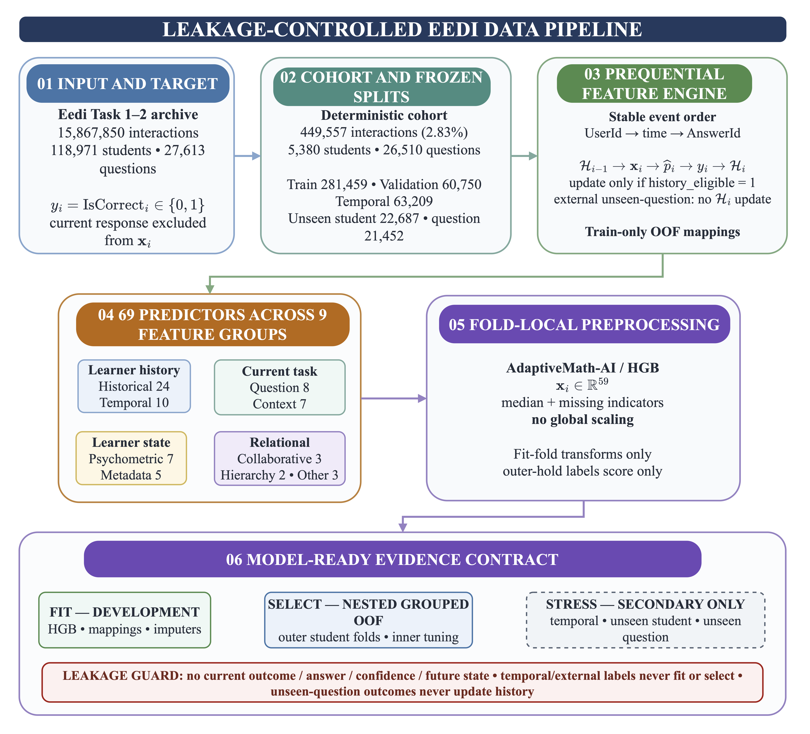
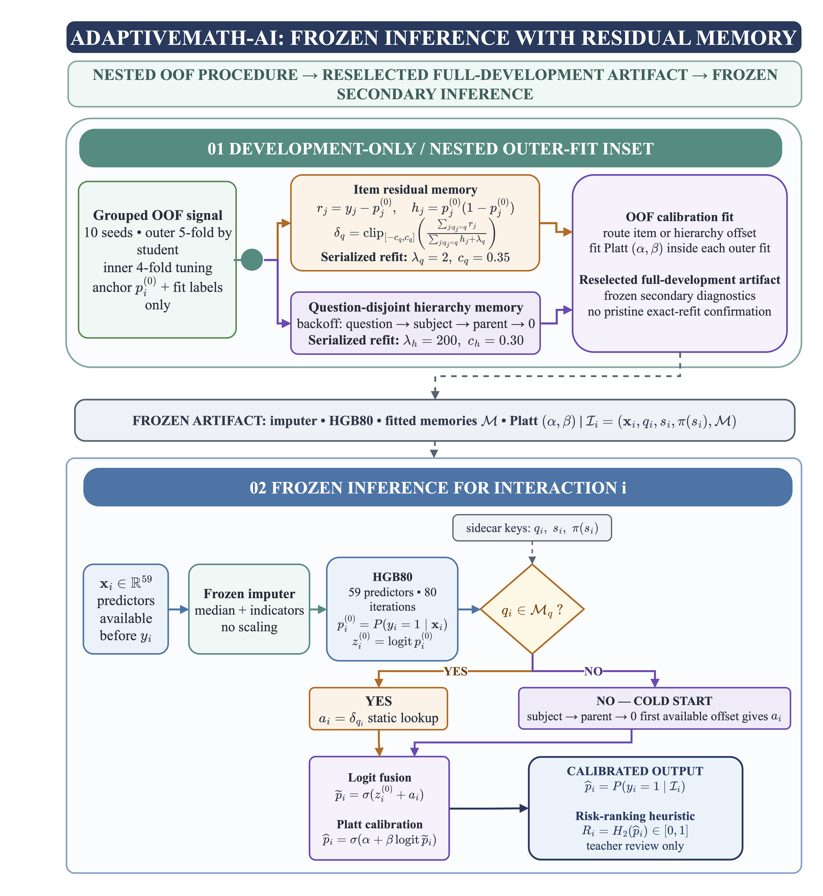

# AdaptiveMath-AI on Eedi

[](https://www.python.org/)
[](https://jupyter.org/)
[](https://www.eedischool.com/projects/neurips-education-challenge)

AdaptiveMath-AI is a reproducible machine-learning pipeline for estimating the probability that a learner's next Eedi mathematics response will be correct. The experiment uses past-only prequential features, temporal and entity-disjoint evaluation, probability calibration, student-clustered uncertainty estimates, and explicit cold-start analysis.

The retained model is compact: an 80-iteration histogram-gradient-boosting anchor is augmented with a Hessian-shrunk question-residual memory. A subject-parent residual fallback is used for previously unseen questions. The contribution is an applied residual-adaptation and evaluation design; it is **not** presented as a new universal deep-learning architecture or as evidence of causal learning improvement.

## Experimental design

- **Target:** binary response correctness immediately before the current answer.
- **Prediction information:** question/context metadata and learner state derived strictly from earlier eligible interactions.
- **Primary evidence:** repeated student-grouped nested validation against an equal-label-budget HGB100 comparator.
- **Secondary diagnostics:** later temporal interactions, unseen learners, unseen questions, and short observed histories.
- **Calibration:** selected within grouped validation; predictive entropy is used only as a prediction-risk ranking score.
- **Scope:** observational prediction. No intervention effect, learning gain, or automated high-stakes decision claim is made.

## Key results

| Evaluation | N | ROC-AUC | Log loss | Brier score | ECE | Evidence role |
|---|---:|---:|---:|---:|---:|---|
| Nested validation | 60,750 | 0.7770 | 0.5395 | 0.1817 | 0.0063 | Primary model-selection evidence |
| Temporal test | 63,209 | 0.7763 | 0.5488 | 0.1855 | 0.0103 | Secondary diagnostic |
| Unseen learners | 22,687 | 0.7694 | 0.5352 | 0.1801 | 0.0094 | Secondary diagnostic |
| Unseen questions | 21,452 | 0.7410 | 0.5704 | 0.1944 | 0.0130 | Secondary diagnostic |

Against the equal-label-budget HGB100 comparator, the primary nested-validation difference was **ΔROC-AUC = +0.001708** with a 95% user-cluster bootstrap interval of **[+0.001077, +0.002360]** and a two-sided bootstrap p-value of **0.000400** (5,000 replicates). The corresponding differences were **−0.001359** for log loss and **−0.000574** for Brier score. The effect is statistically supported within this validation design but practically small; the temporal and cold-start results are not confirmatory superiority evidence.

Source tables are available in [`artifacts/`](artifacts/), especially [`final_primary_fair_comparison.csv`](artifacts/final_primary_fair_comparison.csv) and [`final_validation_primary_metrics.csv`](artifacts/final_validation_primary_metrics.csv).

## Pipeline and model





The complete set of 33 numbered scientific figures is stored in [`figures/`](figures/). File numbers follow the figure order used for the study materials.

## Repository structure

```text
AdaptiveMath-AI-Eedi/
├── dataset/       # official access instructions; runtime data are ignored
├── notebooks/     # six executable notebooks, ordered 01–06
├── artifacts/     # compact set of result tables
├── figures/       # 33 numbered scientific figures
├── requirements.txt
└── README.md
```

## Reproduction

Python 3.11 is recommended. The recorded environment is pinned in [`requirements.txt`](requirements.txt).

```bash
git clone https://github.com/Guldek1987/AdaptiveMath-AI-Eedi.git
cd AdaptiveMath-AI-Eedi
python3.11 -m venv .venv
source .venv/bin/activate
python -m pip install --upgrade pip
python -m pip install -r requirements.txt
jupyter lab
```

Run the notebooks in numeric order:

1. `01_dataset_acquisition_and_research_design.ipynb`
2. `02_data_preprocessing_feature_engineering_and_splits.ipynb`
3. `03_baseline_models.ipynb`
4. `04_sequential_and_deep_models.ipynb`
5. `05_adaptivemath_ai_and_ablations.ipynb`
6. `06_final_evaluation_tables_and_figures.ipynb`

The first two notebooks download the official archive and build the deterministic processed cohort. Later notebooks generate intermediate Parquet predictions and serialized models locally. These runtime files are excluded from version control because they are reproducible, large, and may contain row-level learner records.

The source experiment was executed with Python 3.11.15 on Apple Silicon using a 16 GiB host. PyTorch can use MPS when available; CPU execution remains supported but may be slower. A complete clean run is computationally substantial because the official archive contains approximately 15.9 million interactions before cohort construction.

## Methodological safeguards

- outcome-derived histories are emitted before the current response updates state;
- training encodings are chronological or student-group out-of-fold;
- validation and secondary partitions use train-fitted mappings;
- unseen-question outcomes do not update later predictive state;
- all comparable models use the same deterministic cohort and split IDs;
- the proposed procedure and equal-label comparator are aligned by interaction ID;
- paired uncertainty resamples learners rather than independent interaction rows;
- compact neural methods are labelled as mechanism proxies, not canonical reproductions.

## Data and citation

The dataset is not redistributed. See [`dataset/README.md`](dataset/README.md) for official access and licensing information.

If this repository is useful, cite the Eedi dataset paper:

> Wang, Z., Lamb, A., Saveliev, E., et al. (2021). Results and Insights from Diagnostic Questions: The NeurIPS 2020 Education Challenge. *Proceedings of Machine Learning Research*, 133, 191–205. <https://proceedings.mlr.press/v133/wang21a.html>

No separate code license is asserted by this repository unless a license file is added by the owner.
