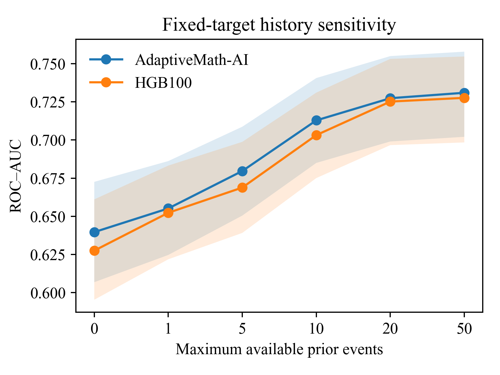
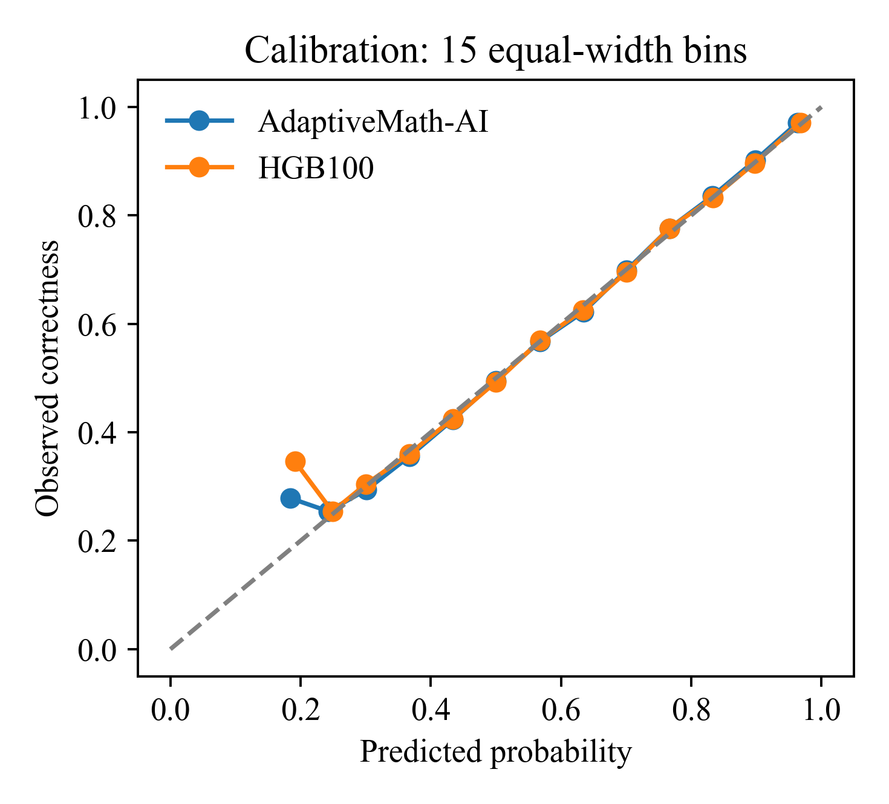

# AdaptiveMath-AI on Eedi

AdaptiveMath-AI estimates the probability of a correct mathematics response from earlier completed interactions. An HGB80 anchor is combined with regularized question-residual adaptation and subject/parent fallback. This is an observational prediction study, not evidence of causal learning improvement or a new universal deep-learning architecture.

## Current executed snapshot

The six notebooks are **byte-for-byte copies of the current working notebooks**, including code, Markdown and saved outputs: **63 cells, 43 code cells and 799 output objects**. Output objects include streams and displays; they are not separate experiments. No training, bootstrap or scientific metric calculation was run to prepare this publication update.

The [snapshot manifest](dataset/notebook_snapshot.json) records source-relative paths, file sizes and SHA-256 checksums for all 44 copied scientific files. This update replaces the superseded notebook/result presentation; earlier versions remain in Git history.

## Evaluation design

- Global calendar-time evaluation uses five advancing outer windows, four expanding inner folds and ten seeds. The initial evaluation boundary is 2019-11-01.
- Item mappings, priors and exposure-SVD use an early representation window ending 2018-12-01. Current-response completion-time, session and context-rate predictors are excluded from the primary feature set.
- Events sharing a completion timestamp are predicted before their state updates. EWM starts at 0.5; a first correct response updates it to 0.575.
- Same-target history diagnostics use caps 0, 1, 5, 10, 20 and 50, respecting timestamp batches.
- Strict cold-start diagnostics distinguish unseen learners, known questions and first responses. Frozen-model unseen-question evaluation separates learner-feedback, outcome-free and no-feedback regimes.
- Student, question and crossed-cluster bootstrap intervals use 5,000 replicates conditional on fitted predictions; per-seed variation is reported separately.

The [temporal design](artifacts/manifests/temporal_design.json) and [state-update contract](artifacts/manifests/state_update_contract.json) document these settings. This is retrospective technical validation of a previously studied source, not independent confirmation.

## Primary results

Interaction-weighted evaluation of 143,565 responses:

| Model | ROC-AUC ↑ | Log loss ↓ | Brier ↓ | ECE15 ↓ |
|---|---:|---:|---:|---:|
| AdaptiveMath-AI | 0.764131 | 0.544365 | 0.184262 | 0.006587 |
| HGB80 | 0.760164 | 0.547416 | 0.185573 | 0.005673 |
| HGB100 | 0.759949 | 0.547553 | 0.185636 | 0.005165 |

Source: [metrics by scenario](artifacts/metrics_by_scenario.csv). These rows use mean temporal-outer probabilities. [Estimand comparison](artifacts/estimand_comparison.csv) distinguishes AUC of mean probabilities from mean seed AUC and frozen-object predictions.

AdaptiveMath-AI minus HGB100 has ΔROC-AUC = **0.004182**. Saved 95% paired intervals are [0.003500, 0.004913] for student clustering, [0.003516, 0.004827] for question clustering and [0.003145, 0.005298] for crossed clustering. The improvement is small. AdaptiveMath-AI has higher ECE15 than both HGB comparators; these results do not show superiority on every metric. See [paired uncertainty](artifacts/paired_uncertainty.csv).

## Strict cold-start and feedback diagnostics

AdaptiveMath-AI, interaction-weighted:

| Evaluation slice / regime | Responses | ROC-AUC | ECE15 |
|---|---:|---:|---:|
| First-response unseen learner | 965 | 0.604142 | 0.026949 |
| Unseen learner / known question | 26,943 | 0.748055 | 0.011260 |
| First-response unseen learner / known question | 905 | 0.604201 | 0.023988 |
| Unseen question / learner feedback | 7,071 | 0.690293 | 0.019740 |
| Unseen question / outcome-free | 7,071 | 0.595990 | 0.023676 |
| Unseen question / no feedback | 7,071 | 0.593884 | 0.027084 |

The first three rows use advancing outer-fold models; the last three use a frozen model on identical unseen-question targets. These are different estimands, not interchangeable rankings. Timestamp ties can produce several first-response rows for one learner.

Sources: [slice metrics](artifacts/strict_cold_start_and_feedback_metrics.csv), [paired intervals](artifacts/strict_cold_start_and_feedback_intervals.csv) and [seed variability](artifacts/strict_cold_start_and_feedback_seed_variability.csv).

## Saved figures

The four current PNG files are copied unchanged from the working experiment, exported at **350 DPI**. Their original filenames are retained; no manuscript numbering is inferred.





Also available: [risk–coverage](figures/revision_risk_coverage.png) and [learning curves](figures/revision_learning_curves.png). Full scientific displays remain under their original notebook cells.

## Notebooks

1. [Dataset and research design](notebooks/01_dataset_download_audit_and_research_design.ipynb)
2. [Preprocessing, features and temporal splits](notebooks/02_data_preprocessing_feature_engineering_and_splits.ipynb)
3. [Baseline models](notebooks/03_baseline_models.ipynb)
4. [Matched-information sequence models](notebooks/04_sota_models.ipynb)
5. [AdaptiveMath-AI and ablations](notebooks/05_proposed_hybrid_model_and_ablations.ipynb)
6. [Evaluation, tables and figures](notebooks/06_final_validation_tables_figures_and_reports.ipynb)

Scientific module definitions are visible in notebook cells. Cross-notebook imports require keeping all six original filenames.

## Viewing and execution prerequisites

Saved outputs can be inspected without executing cells. The [requirements file](requirements.txt) records the installed Python 3.11 experiment environment.

```bash
git clone https://github.com/Guldek1987/AdaptiveMath-AI-Eedi.git
cd AdaptiveMath-AI-Eedi
python3.11 -m venv .venv
source .venv/bin/activate
python -m pip install -r requirements.txt
jupyter lab
```

**This is an executed-source-and-results snapshot, not a self-contained fresh-clone training bundle.** The unchanged notebooks retain dependencies on the original raw/derived data, frozen model objects, historical source/provenance files and an external local protocol-plan path. Some cross-stage checks also depend on previously generated downstream artifacts. A clean-clone “Run All” has not been verified and cannot be assumed to work from the published files alone.

These dependencies were not silently removed or replaced to make the copies appear portable. See [data and runtime prerequisites](dataset/README.md). This update does not newly redistribute learner-level records, model binaries or the full original provenance archive.

The repository supplies `Data → dataset` and `Tables → artifacts` path aliases. On case-sensitive filesystems, the unchanged source additionally requires `Notebooks → notebooks`, `Figures → figures` and `Models → models` aliases. Aliases alone do not supply the missing runtime inputs.

## Interpretation and limitations

- Completion timestamps do not establish when questions were presented. Calendar-time evaluation is not a prospective deployment trial.
- The historical selected cohort has minimum learner activity 29; a ≥20 filter removes no members of that cohort. This cannot establish performance on absent low-activity learners.
- Fixed-prediction bootstrap intervals do not include full model-refitting uncertainty. Identical predictions from deterministic seed runs are not independent evidence.
- GRU/SAKT comparators are compact mechanism proxies, not canonical reproductions.
- HGB comparators share anchor tuning and calibration opportunities; AdaptiveMath-AI has additional declared component tuning. This is not identical total candidate-count budgeting.
- No independent untouched confirmation sample or causal educational benefit is claimed.

Temporary workflow/transfer files already present in repository history are not part of this curated scientific snapshot. The publication commit skips CI to avoid triggering calculations.

## Dataset and citation

Official data access is described in [dataset/README.md](dataset/README.md).

Wang, Z., Lamb, A., Saveliev, E., et al. (2021). *Results and Insights from Diagnostic Questions: The NeurIPS 2020 Education Challenge*. Proceedings of Machine Learning Research, 133, 191–205. [Dataset paper](https://proceedings.mlr.press/v133/wang21a.html).

No separate code license is asserted unless a license file is added by the repository owner.
