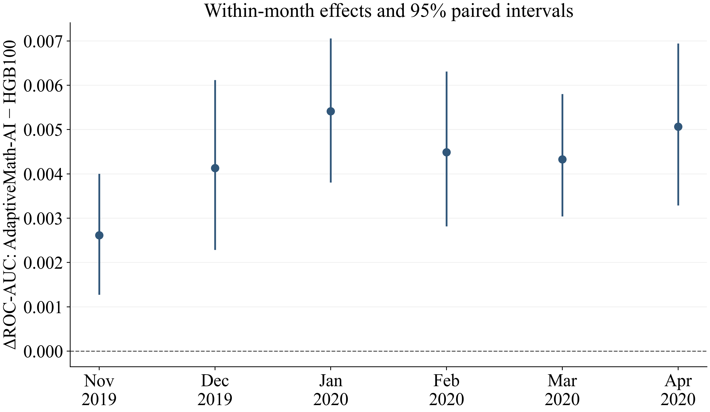
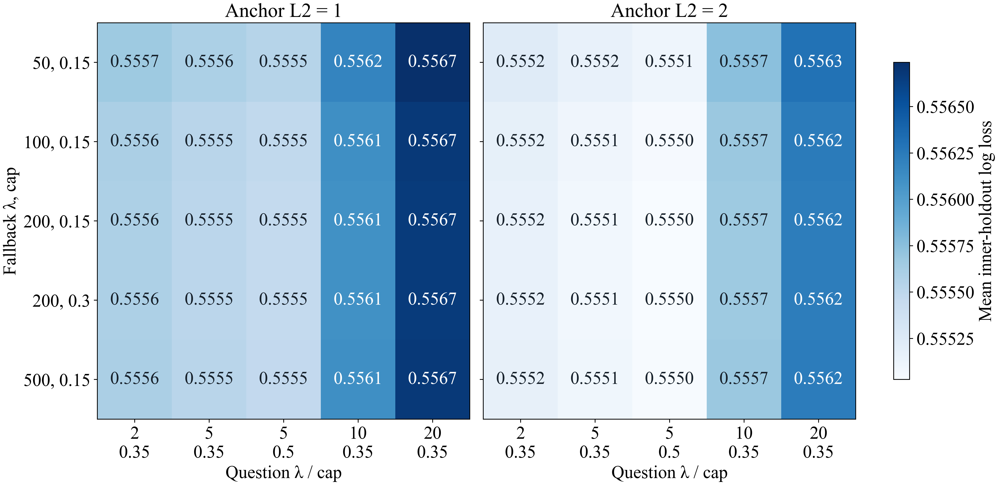

# AdaptiveMath-AI · Eedi response prediction

Temporal prediction of whether a learner will answer a mathematics question correctly, using information from earlier completed responses.

**AdaptiveMath-AI** combines a histogram-gradient-boosting anchor with regularized residual correction and supported question → subject → parent fallback. It is a tree-based probabilistic hybrid, not a new deep-learning architecture or evidence of improved classroom learning.

**Updated 1 October 2026:** six executed notebooks, the six-window experiment, matched component controls, current tables, and all 12 notebook figures. Source, Markdown and saved outputs are copied **byte-for-byte** from the working notebooks. No models were retrained, no bootstrap was repeated, and no scientific results were recalculated for this update.

> **Reproduction boundary.** This repository publishes the executed scientific source and aggregate evidence. It does **not** include transformed learner-level datasets, row-level predictions, fitted model binaries, or the independent local control-run archive. Saved results can be read immediately; a fresh-clone “Run All” is **not** certified. See [data access and execution prerequisites](dataset/README.md).

## Main result

The primary estimand is the **equal-weight mean of six within-month metrics**. Probabilities are first averaged over seeds within each month. These values must not be confused with pooled AUC or mean seed AUC.

| Model | ROC-AUC ↑ | Log loss ↓ | Brier ↓ | ECE15 ↓ |
|---|---:|---:|---:|---:|
| HGB80 | 0.756927 | 0.547785 | 0.185711 | 0.013976 |
| HGB100 | 0.756833 | 0.547904 | 0.185759 | 0.014948 |
| AdaptiveMath-AI | 0.761173 | 0.544721 | 0.184383 | 0.014286 |
| Question-only residual correction | 0.761181 | 0.544675 | 0.184364 | 0.013768 |
| Converged item-intercept control | 0.761180 | 0.544678 | 0.184365 | 0.013779 |
| Matched recent-question-rate control | 0.760553 | 0.545278 | 0.184598 | 0.014019 |

Source: [complete nine-variant results](artifacts/Round2/round2_ablation_metrics.csv). All variants use the same **143,565 evaluation responses**. [Monthly results](artifacts/Round2/round2_window_metrics.csv) retain differences across time rather than collapsing them into one pooled ranking. AP for both classes and calibration intercept/slope are included in the CSVs.

AdaptiveMath-AI improves mean monthly AUC over HGB100 by **0.004339**, with a **95% paired conditional interval [0.003636, 0.005131]**. The ECE15 difference is −0.000662, with interval [−0.002098, 0.001394]; a calibration advantage is not established. [Primary intervals](artifacts/Round2/round2_window_macro_bootstrap.csv).



## What the component comparisons support

| Contrast: first minus second | ΔROC-AUC | 95% paired interval |
|---|---:|---:|
| AdaptiveMath-AI − no-question variant | 0.004564 | [0.004036, 0.005185] |
| AdaptiveMath-AI − no-subject variant | −0.000035 | [−0.000110, 0.000044] |
| AdaptiveMath-AI − question-only | −0.000009 | [−0.000086, 0.000068] |
| Question-only − converged item-intercept | 0.000001 | [−0.000003, 0.000005] |
| Question-only − matched recent-rate control | 0.000628 | [0.000304, 0.000928] |

The residual correction has a small supported benefit over the matched recent-rate control. **An additional hierarchy benefit is not established.** The one-step and converged item-intercept estimates are almost indistinguishable; an interval containing zero does not prove equivalence.

Sources: [component intervals](artifacts/Round2/round2_ablation_paired_intervals.csv), [matched-control intervals](artifacts/Round2/round2_recency_control_intervals.csv). Intervals are nominal; the component family additionally reports Holm-adjusted p-values by metric. The resampling conditions on fitted predictions and does not include refitting uncertainty.

## Experiment in brief

- **Task and unit:** binary `IsCorrect` prediction; one `AnswerId` is an observation, with dependence across learners and questions.
- **Cohort:** deterministic identifier-based selection; 385,037 interactions, 2,904 learners and 25,899 questions. Median question support is eight responses. The supplied source has minimum learner activity 29, so a ≥20 rule excludes no supplied learner.
- **Time boundary:** development precedes 1 November 2019. Six advancing outer windows cover November 2019 through April 2020; the final boundary is **30 April 2020, exclusive**.
- **Budget:** 10 seeds × 6 outer windows × 4 expanding inner folds. HGB controls have 80 or 100 iterations; candidate anchor L2 and calibration families are shared. Hybrid component tuning adds declared opportunities, not an identical total candidate count.
- **Information boundary:** mappings, priors and item representations use the early prefix ending 1 December 2018. Current-response completion-time features are excluded. Every timestamp batch is predicted before its permitted state updates.
- **Calibration:** each variant independently selects/fits its permitted calibration. The primary evaluation uses 15 equal-width bins.
- **Uncertainty:** 5,000 paired student-bootstrap draws, using common learner multiplicities across all six months. Response-weighted and pooled estimates are separate secondary diagnostics.

The [fixed protocol](artifacts/Round2/manifests/revision_protocol.json), [temporal design](artifacts/Round2/manifests/temporal_design.json), [field availability](artifacts/Round2/manifests/field_availability.json) and [state-update contract](artifacts/Round2/manifests/state_update_contract.json) preserve exact settings. Broader scenario definitions in the protocol are not, by themselves, evidence of a newly executed result.

## Six-notebook scientific workflow

| Notebook | Scientific role |
|---|---|
| [01 · Dataset analysis and research design](notebooks/01_dataset_analysis_and_research_design.ipynb) | Local-data characteristics, development quality, sparsity, eligibility and information availability; no model fitting |
| [02 · Feature analysis and leakage-safe preprocessing](notebooks/02_feature_analysis_and_leakage_safe_preprocessing.ipynb) | Calendar splits, chronological replay, timestamp ties, features and development dependencies |
| [03 · Baselines and error diagnostics](notebooks/03_baseline_models_and_error_diagnostics.ipynb) | HGB controls, prior-information references and error complementarity |
| [04 · Modern models and comparative diagnostics](notebooks/04_modern_models_and_comparative_diagnostics.ipynb) | Matched-information GRU/SAKT proxies, candidate configurations and recorded learning curves |
| [05 · Proposed model and ablations](notebooks/05_proposed_model_development_and_ablations.ipynb) | AdaptiveMath-AI mathematics, visible implementation, component controls, tuning and route support |
| [06 · Frozen evaluation and publication results](notebooks/06_frozen_evaluation_statistics_and_publication_results.ipynb) | Final metrics, paired intervals, calibration, subgroup diagnostics, equal-budget review and event-stream cost |

All scientific functions/classes live in notebook cells. A notebook-source loader shares those definitions; **no external scientific Python modules are required**. Keep all six filenames unchanged.

Notebook 04 is a **supporting fixed-split experiment**, not a six-window nested comparison or a canonical DKT/SAKT reproduction. Its results are not pooled with the primary estimates.

## Figures and aggregate evidence

All 12 figures are supplied as unchanged PNG and PDF files, with **Matplotlib, Times New Roman, 18–20 pt and 350 DPI**. Figure identifiers follow their notebook names; manuscript numbering is not invented.



The tuning surface is development evidence, not a final-test result. Further figures cover source sparsity, development-time coverage, feature interactions, baseline errors, sequence learning curves, route support and monthly calibration.

Browse the [figure index](figures/README.md) and [table index](artifacts/README.md). Subgroup calibration is descriptive, equal-budget review measures classification-error retrieval rather than educational benefit, and warm-stream latency excludes model loading and historical-state preparation.

## Reading and local setup

Saved notebook outputs can be viewed on GitHub or in JupyterLab without rerunning the experiment.

```bash
git clone https://github.com/Guldek1987/AdaptiveMath-AI-Eedi.git
cd AdaptiveMath-AI-Eedi
python3.11 -m venv .venv
source .venv/bin/activate
python -m pip install -r requirements.txt

# Needed only on case-sensitive POSIX filesystems:
test -d Notebooks || ln -s notebooks Notebooks
test -d Figures || ln -s figures Figures
test -d Models || ln -s models Models

jupyter lab notebooks
```

`Data → dataset` and `Tables → artifacts` are included path aliases. The plotting cells intentionally require an installed **Times New Roman** font; the proprietary font is not redistributed. Platform-specific setup, including Windows aliases, has not been tested.

For execution rather than reading, follow [the dependency inventory](dataset/README.md). Downloading raw data alone does not provide every saved prediction, checkpoint or historical comparison dependency. No automatic training workflow is enabled.

## Preservation and limits

- The [snapshot manifest](dataset/notebook_snapshot.json) identifies all **56 copied scientific files** by relative source path and SHA-256. The notebooks contain **319 cells, 157 code cells, 151 output objects and 12 embedded figures**, with no saved error outputs.
- Packaging verifies exact file identity and saved output integrity; it does not constitute a new raw-data reproduction run. Previous repository versions remain available in Git history.
- Calendar ordering uses answer completion, not question presentation. Static hierarchy availability is an assumption because metadata version times are absent.
- The previously studied source is not an untouched independent confirmation sample. Low-activity learners absent from the supplied source are not simulated.
- Null component effects are retained. Deterministic predictions across seeds do not create independent confirmations.
- Broader transfer, causal learning gains and superiority over canonical neural models are not claimed.

## Data rights and citation

Eedi publishes the source under [CC BY-NC-ND 4.0](https://creativecommons.org/licenses/by-nc-nd/4.0/), with additional restrictions on question images. Obtain data from the [official provider](https://www.eedischool.com/projects/neurips-education-challenge). This repository does not redistribute transformed learner-level records or question images.

Wang, Z., Lamb, A., Saveliev, E., et al. (2021). *Results and Insights from Diagnostic Questions: The NeurIPS 2020 Education Challenge*. Proceedings of Machine Learning Research, 133, 191–205. [Dataset paper](https://proceedings.mlr.press/v133/wang21a.html).

The dataset license is not a software license. No separate code license is asserted on the owner's behalf.
